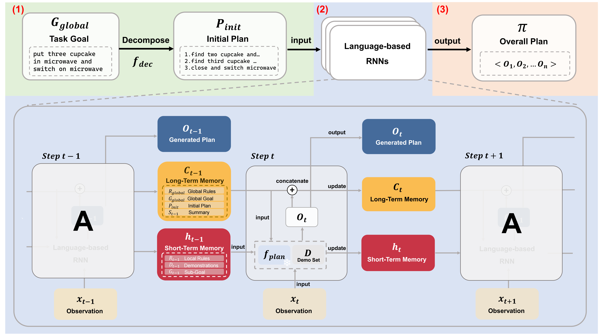
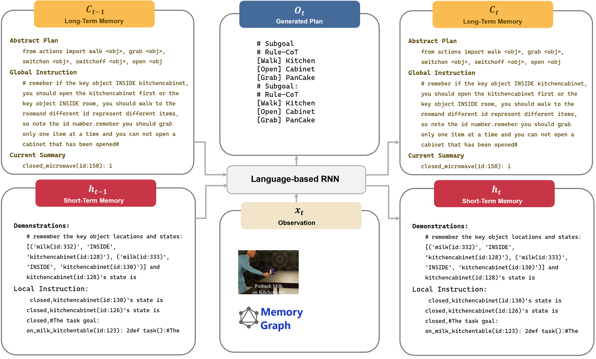

<!-- <h1 align="center"> Faithful LLMs for Long-Horizon Task Planning </h1> -->

<!--

  ICRA 2024

-->

<!--
[author1](https://www.yuque.com/zhangjiatao-grdyv/rn49ht/lq7xzy4xmxgrpgz9), [author2](https://www.yuque.com/zhangjiatao-grdyv/rn49ht/vsarazgdts43o7y4)
-->

## Abstract
Recent planning methods based on Large Language Models typically employ the In-Context Learning paradigm. Complex long-horizon planning tasks require more context(including instructions and demonstrations) to guarantee that the generated plan can be executed correctly. However, in such conditions, LLMs may overlook(unfaithful) the rules in the given context, resulting in the generated plans being invalid or even leading to dangerous actions. In this paper, we investigate the faithfulness of LLMs for complex long-horizon tasks. Inspired by human intelligence, we introduce a novel framework named FLTRNN. FLTRNN employs a language-based RNN structure to integrate task decomposition and memory management into LLM planning inference, which could effectively improve the faithfulness of LLMs and make the planner more reliable. We conducted experiments in VirtualHome household tasks. Results show that our model significantly improves faithfulness and success rates for complex long-horizon tasks.

## Video
<iframe width="780" height="400" src="https://www.youtube.com/embed/rGmoljGmKPI?si=5OGDlNhLa8FowUrK" title="YouTube video player" frameborder="0" allow="accelerometer; autoplay; clipboard-write; encrypted-media; gyroscope; picture-in-picture; web-share" allowfullscreen></iframe>
    
## Results
Example of our frameworks for long-horizon task planning:

  

## Methodology
Our framework takes the task goal as input and produces the task plan as output. Our framework consists of three stages: 
1. Decompose a long-horizon task into several simpler sub-tasks and formulate an initial plan.
2. Use Language-Based RNNs to solve each sub-task in the initial plan, in which the task goal, initial plan, and instructions are represented as long-term memory, while the selected sub-goal in the plan, demonstration, and specific details of the sub-task are designated as short-term memory.
3. Aggregate the plans generated by the RNNs to form the overall task plan. Besides, the rule Chain-of-Thought(Rule-CoT) and memory graph are used to enhance the reasoning ability of LLMs.

  

 

  

## Appendix
### A.Method
#### 1.Prompt of Task Decomposition

Listing 1: Prompt for finishing task decomposition,we only need to input the Fixed-format task goal in the dataset

    

    <pre>
Please split the task goal，and there are some examples:

      
Task Goal: on_poundcake_kitchentable(id:123): 1,on_milk_kitchentable(id:123): 1, 
#The goal means the task is "put one poundcake on kitchentable and put one milk on kitchentable" 
#so we can split the goal into 2 subgoal,follow this return format exactly. 
return subgoal[on_poundcake_kitchentable(id:123): 1], subgoal[on_milk_kitchentable(id:123): 1]

Task Goal: on_chicken_kitchentable(id:123): 2, 
#The goal means the task is "put two chickens on the kitchentable" 
#so we can split the goal into 1 subgoal,follow this return format exactly. 
return subgoal[on_chicken_kitchentable(id:123): 2]

Task Goal: closed_microwave(id:158): 1,turnon_microwave(id:158): 1,closed_stove(id:150): 1,turnon_stove(id:150):1,inside_pancake_microwave(id:158): 1,inside_cupcake_stove(id:150): 1, 
#The goal means the task is "put one pancake in microwave and switch on microwave, put one cupcake in stove and switch on stove" 
#so we can split the goal into 2 subgoal,follow this return format exactly. 
return subgoal[closed_microwave(id:158): 1,turnon_microwave(id:158): 1,inside_pancake_microwave(id:158): 1], subgoal[closed_stove(id:150): 1,turnon_stove(id:150): 1,inside_cupcake_stove(id:150): 1]

Task Goal:closed_stove(id:150): 1,turnon_stove(id:150): 1,inside_poundcake_stove(id:150):3,on_milk_kitchentable(id:123): 2, 
#The goal means the task is "put three poundcakes in stove and switch on stove, put two milk on kitchentable" 
#so we can split the goal into 2 subgoal,follow this return format exactly. 
return subgoal[closed_stove(id:150):1,turnon_stove(id:150):1 ,inside_poundcake_stove(id:150):3],subgoal[on_milk_kitchentable(id:123): 2]

Task Goal:{input} 
  </pre>
  

#### 2.Prompt of Task Planning

Listing 2: The full prompt with LLM of our agent to implement task planning

    

    <pre>

long-term memory:
      
from actions import walk (obj), grab (obj), switchon (obj), switchoff (obj), open (obj), close (obj), putin (obj) (obj), putback (obj) (obj)

#remeber if the key object INSIDE kitchencabinet, you should open the kitchencabinet first or the key object INSIDE room, you should walk to the room,and different id represent different items, so note the id number. # remeber you should grab only one item at a time and you can not open a cabinet that has been opened

#The total task goal: {task_goal}
#The completed task goal: {completed_goal}

short-term memory:

There are some examples:

{example_task1}
{example_task2}
{example_task3}

 #remember the key object locations and states: {message}
 #The task goal: {current_task_goal}
def task():
  </pre>
  

Listing 3:In the short-term memory, dynamically select three examples according to the current task goal and insert them into the prompt.Here is a set of examples to choose from.

    

    <pre>
-------------------------------------------------------------------------- 
# remember the key object locations and states: [("stove(id:150)", "INSIDE", "kitchen(id:50)"), ("chicken(id:332)", "INSIDE", "microwave(id:158)"),("chicken(id:333)", "INSIDE", "microwave(id:158)")] and stove(id:150)'s states are closed,off,microwave(id:158)'s states are closed,off, 
#The task goal: closed_stove(id:150): 1,turnon_stove(id:150): 1,inside_chicken_stove(id:150): 2, 
def task():
#The goal means the task is "put two chickens in stove and switch on stove" 
#1.Subgoal Thought: find the first chicken
#2.Rule Thought: The chicken(id:332) inside microwave(id:158),the microwave is closed,so we should open the microwave first
walk('kitchen(id:50)')
find('microwave(id:158)')
open('microwave(id:158)')
grab('chicken(id:332)')
close('microwave(id:158)')
#0.Rule Thought: You have grabbed chicken, remember you should grab only one item at a time,so put the chicken first. 
#1.Subgoal Thought: put the chicken in stove
#2.Rule Thought: put the chicken in stove（id:150）, the stove is closed, so we should open the stove first. find('stove(id:150)')
open('stove(id:150)')
putin('chicken(id:332)', 'stove(id:150)')
close('stove(id:150)')
#1.Subgoal Thought:find the second chicken
#2.Rule Thought: the second chicken(id:333) inside microwave(id:158),the microwave is closed,so we should open the
microwave first
walk('kitchen(id:50)')
find('microwave(id:158)')
open('microwave(id:158)')
grab('chicken(id:333)')
close('microwave(id:158)')
#0.Rule Thought: You have grabbed chicken,remember you should grab only one item at a time,so put the chicken first. 
#1.Subgoal Thought:put the chicken in stove
#2.Rule Thought: put the chicken in stove(id:150), the stove is closed, so we should open the stove first. open('stove(id:150)')
putin('chicken(id:333)', 'stove(id:150)')
close('stove(id:150)')
#1.Subgoal Thought:switch on the stove
#2.Rule Thought: When we switch on the stove, we should make sure it is closed. switchon('stove(id:150)')
# done
--------------------------------------------------------------------------
-------------------------------------------------------------------------- 
# remember the key object locations and states: [('pancake(id:342)', 'INSIDE', 'livingroom(id:262)')] and microwave(id:158)'s states are closed,off, #The task goal: closed_microwave(id:158): 1,turnon_microwave(id:158): 1,inside_pancake_microwave(id:158): 1
def task():
#The goal means the task is "put one pancake in microwave and switch on microwave". 
#1.Subgoal Thought: find one pancake. #2.Rule Thought: The pancake(id:342) inside livingroom(id:262),so we should walk to the livingroom first. 
walk('livingroom(id:262)')
find('pancake(id:342)')
grab('pancake(id:342)')
#0.Rule Thought: You have grabbed pancake,remember you should grab only one item at a time,so put the pancake first. 
#1.Subgoal Thought: put the pancake in microwave. #2.Rule Thought: put the pancake(id:342) in microwave(id:158), the microwave is closed, so we should open the microwave first.
find('microwave(id:158)')
open('microwave(id:158)')
putin('pancake(id:342)', 'microwave(id:158)')
close('microwave(id:158)')
#1.Subgoal Thought:switch on the microwave
#2.Rule Thought: When we switch on the microwave, we should make sure it is closed. 
switchon('microwave(id:158)')
# done
--------------------------------------------------------------------------
-------------------------------------------------------------------------- 
#remember the key object locations and states: [('cupcake(id:334)', 'INSIDE', 'kitchencabinet(id:131)'), ('cupcake(id:332)','INSIDE', 'kitchencabinet(id:130)'), ('cupcake(id:333)', 'INSIDE', 'kitchencabinet(id:126)')] and stove(id:150)'s states are closed,off,kitchencabinet(id:131)'s state is closed,kitchencabinet(id:130)'s state is closed,kitchencabinet(id:126)'s state is closed, 
#The task goal: closed_stove(id:150): 1,turnon_stove(id:150): 1,inside_cupcake_stove(id:150): 1
def task():
#The goal means the task is "put one cupcake in stove and switch on stove." 
#1.Subgoal Thought: find one cupcake. 
#2.Rule Thought: The cupcake(id:334) inside kitchencabinet(id:131),the kitchencabinet is closed,so we should open the kitchencabinet first. 
find('kitchencabinet(id:131)')
open('kitchencabinet(id:131)')
find('cupcake(id:334)')
grab('cupcake(id:334)')
close('kitchencabinet(id:131)')
#0.Rule Thought: You have grabbed cupcake,remember you should grab only one item at a time,so put the cupcake first. 
#1.Subgoal Thought: put the cupcake in stove
#2.Rule Thought: put the cupcake(id:334) in stove(id:150), and the stove is closed, so we should open the stove first. 
find('stove(id:150)')
open('stove(id:150)')
putin('cupcake(id:334)', 'stove(id:150)')
close('stove(id:150)')
#1.Subgoal Thought:switch on the stove
#2.Rule Thought: When we switch on the stove, we should make sure it is closed. 
switchon('stove(id:150)')
# done
--------------------------------------------------------------------------
-------------------------------------------------------------------------- 
# remember the key object current locations and states: [('chicken(id:332)', 'INSIDE', 'fridge(id:149)')] and fridge(id:149)'sstate is closed, 
#The task goal: on_chicken_kitchentable(id:123): 1
def task():
#The goal means the task is "put one chicken on kitchentable" 
#1.Subgoal Thought: find the chicken
#2.Rule Thought: The chicken(id:332) inside fridge(id:149), the fridge is closed,so we should open the fridge first. 
find('fridge(id:149)')
open('fridge(id:149)')
grab('chicken(id:332)')
close('fridge(id:149)')
#0.Rule Thought: You have grabbed chicken,remember you should grab only one item at a time,so put the chicken first. 
#1.Subgoal Thought: put the chicken on the kitchentable
#2.Rule Thought: put the chicken(id:332) on the kitchentable(id:123). find('kitchentable(id:123)')
putback('chicken(id:332)', 'kitchentable(id:123)')
# done
--------------------------------------------------------------------------
-------------------------------------------------------------------------- 
# remember the key object locations and states: [('milk(id:332)', 'INSIDE', 'kitchencabinet(id:128)'), ('milk(id:333)','INSIDE', 'kitchencabinet(id:130)')] and kitchencabinet(id:128)'s state is closed,kitchencabinet(id:130)'s state is closed,kitchencabinet(id:126)'s state is closed, #The task goal: on_milk_kitchentable(id:123): 2
def task():
#The goal means the task is "put two milk on kitchentable" 
#1.Subgoal Thought: find the first milk
#2.Rule Thought: The milk(id:332) inside kitchencabinet(id:128), the kitchencabinet is closed,so we should open the kitchencabinet first. 
walk('kitchen(id:50)')
find('kitchencabinet(id:128)')
open('kitchencabinet(id:128)')
find('milk(id:332)')
grab('milk(id:332)')
close('kitchencabinet(id:128)')
#0.Rule Thought: You have grabbed milk,remember you should grab only one item at a time,so put the milk first. 
#1.Subgoal Thought: put the first milk on the kitchentable
#2.Rule Thought: put the milk(id:332) on the kitchentable(id:123)
find('kitchentable(id:123)')
putback('milk(id:332)', 'kitchentable(id:123)')
#1.Subgoal Thought: find the second milk
#2.Rule Thought: The milk(id:333) inside kitchencabinet(id:130), the kitchencabinet is closed,so we should open the kitchencabinet first. find('kitchencabinet(id:130)')
open('kitchencabinet(id:130)')
find('milk(id:333)')
grab('milk(id:333)')
close('kitchencabinet(id:130)')
#0.Rule Thought: You have grabbed milk,remember you should grab only one item at a time,so put the milk first. 
#1.Subgoal Thought: put the second milk on the kitchentable
#2.Rule Thought: put the milk(id:333) on the kitchentable(id:123)
find('kitchentable(id:123)')
putback('milk(id:333)', 'kitchentable(id:123)')
# done
--------------------------------------------------------------------------
-------------------------------------------------------------------------- 
# remember the key object locations and states: [('chicken(id:333)', 'INSIDE', 'stove(id:150)'), ('chicken(id:332)', 'INSIDE','fridge(id:149)')] and stove(id:150)'s states are closed,off,fridge(id:149)'s state is closed, 
#The task goal: on_chicken_kitchentable(id:123): 2
def task():
#The goal means the task is "put two chickens on kitchentable" 
#1.Subgoal Thought: find the first chicken
#2.Rule Thought: The chicken(id:332) inside fridge(id:149),the fridge is closed, so we should open the fridge first
open('fridge(id:149)')
find('chicken(id:332)')
grab('chicken(id:332)')
close('fridge(id:149)')
#0.Rule Thought: You have grabbed chicken,remember you should grab only one item at a time,so put the chicken first. 
#1.Subgoal Thought: put the chicken on kitchentable
#2.Rule Thought: put the chicken(id:332) on kitchentable(id:123)
find('kitchentable(id:123)')
putback('chicken(id:332)', 'kitchentable(id:123)')
#1.Subgoal Thought:find the second chicken
#2.Rule Thought: The chicken(id:333) inside stove(id:150),the stove is closed, so we should open the stove first
open('stove(id:150)')
find('chicken(id:333)')
grab('chicken(id:333)')
close('stove(id:150)')
#0.Rule Thought: You have grabbed chicken,remember you should grab only one item at a time,so put the chicken first. 
#1.Subgoal Thought: put the chicken on kitchentable
#2.Rule Thought: put the chicken(id:333) on kitchentable(id:123)
find('kitchentable(id:123)')
putback('chicken(id:333)', 'kitchentable(id:123)')
# done
--------------------------------------------------------------------------
  </pre>
  

isting 4: An example of our method, full interaction process of the task goal {on_chicken_kitchentable(id:123): 2}

    

    <pre>
------------------------------------------------input prompt-------------------------------------------------------------
long_memory:
      
from actions import walk (obj), grab (obj), switchon (obj), switchoff (obj), open (obj), close (obj), putin (obj) (obj), putback (obj) (obj)
#remeber if the key object INSIDE kitchencabinet, you should open the kitchencabinet first or the key object INSIDE room, you should walk to the roomand different id represent different items, so note the id number.remeber you should grab only one item at a time and you can not open a cabinet that has been opened
#The total task goal: on_chicken_kitchentable(id:123): 2, 
#The completed task goal:

short_memory:

There are some examples:
#remember the key object locations and states: [('chicken(id:333)', 'INSIDE', 'stove(id:150)'), ('chicken(id:332)','INSIDE', 'fridge(id:149)')] and stove(id:150)'s states are closed,of ,fridge(id:149)'s state is closed, #The task goal: on_chicken_kitchentable(id:123): 2
def task():
#The goal means the task is "put two chickens on kitchentable" 
#1.Subgoal Thought: find the first chicken
#2.Rule Thought: The chicken(id:332) inside fridge(id:149),the fridge is closed, so we should open the fridge first
open('fridge(id:149)')
find('chicken(id:332)')
grab('chicken(id:332)')
close('fridge(id:149)')
#1.Subgoal Thought: put the chicken on kitchentable
#2.Rule Thought: put the chicken(id:332) on kitchentable(id:123)
find('kitchentable(id:123)')
putback('chicken(id:332)', 'kitchentable(id:123)')
#1.Subgoal Thought:find the second chicken
#2.Rule Thought: The chicken(id:333) inside stove(id:150),the stove is closed, so we should open the stove first
open('stove(id:150)')
find('chicken(id:333)')
grab('chicken(id:333)')
close('stove(id:150)')
#1.Subgoal Thought: put the chicken on kitchentable
#2.Rule Thought: put the chicken(id:333) on kitchentable(id:123)
find('kitchentable(id:123)')
putback('chicken(id:333)', 'kitchentable(id:123)')
#done

#remember the key object current locations and states: [('chicken(id:332)', 'INSIDE', 'fridge(id:149)')] and fridge(id:149)'s state is closed, #The task goal: on_chicken_kitchentable(id:123): 1
def task():
#The goal means the task is "put one chicken on kitchentable" #1.Subgoal Thought: find the chicken
#2.Rule Thought: The chicken(id:332) inside fridge(id:149), the fridge is closed,so we should open the fridge first. find('fridge(id:149)')
open('fridge(id:149)')
grab('chicken(id:332)')
close('fridge(id:149)')
#1.Subgoal Thought: put the chicken on the kitchentable
#2.Rule Thought: put the chicken(id:332) on the kitchentable(id:123). find('kitchentable(id:123)')
putback('chicken(id:332)', 'kitchentable(id:123)')
#done

#remember the key object locations and states: [('milk(id:332)', 'INSIDE', 'kitchencabinet(id:128)'), ('milk(id:333)','INSIDE', 'kitchencabinet(id:130)')] and kitchencabinet(id:128)'s state is closed,kitchencabinet(id:130)'s state is closed,kitchencabinet(id:126)'s state is closed, 
#The task goal: on_milk_kitchentable(id:123): 2
def task():
#The goal means the task is "put two milk on kitchentable" 
#1.Subgoal Thought: find the first milk
#2.Rule Thought: The milk(id:332) inside kitchencabinet(id:128), the kitchencabinet is closed,so we should open the kitchencabinet first.
walk('kitchen(id:50)')
find('kitchencabinet(id:128)')
open('kitchencabinet(id:128)')
find('milk(id:332)')
grab('milk(id:332)')
close('kitchencabinet(id:128)')
#1.Subgoal Thought: put the first milk on the kitchentable
#2.Rule Thought: put the milk(id:332) on the kitchentable(id:123)
find('kitchentable(id:123)')
putback('milk(id:332)', 'kitchentable(id:123)')
#1.Subgoal Thought: find the second milk
#2.Rule Thought: The milk(id:333) inside kitchencabinet(id:130), the kitchencabinet is closed,so we should open the kitchencabinet first.
find('kitchencabinet(id:130)')
open('kitchencabinet(id:130)')
find('milk(id:333)')
grab('milk(id:333)')
close('kitchencabinet(id:130)')
#1.Subgoal Thought: put the second milk on the kitchentable
#2.Rule Thought: put the milk(id:333) on the kitchentable(id:123)
find('kitchentable(id:123)')
putback('milk(id:333)', 'kitchentable(id:123)')
#done

#remember the key object locations and states: [('chicken(id:332)', 'INSIDE', 'fridge(id:149)'), ('chicken(id:333)','INSIDE', 'fridge(id:149)'), ('chicken(id:334)', 'INSIDE', 'stove(id:150)')] and fridge(id:149)'s state is closed,fridge(id:149)'s state is closed,stove(id:150)'s state is closed, 
#The task goal: on_chicken_kitchentable(id:123): 2
def task(): 
-------------------------------------------------------end----------------------------------------------------------

-------------------------------------------------our agent output---------------------------------------------------- 
#The goal means the task is "put two chickens on kitchentable" 
#1.Subgoal Thought: find the first chicken
#2.Rule Thought: The chicken(id:332) inside fridge(id:149),the fridge is closed, so we should open the fridge first
open('fridge(id:149)')
find('chicken(id:332)')
grab('chicken(id:332)')
close('fridge(id:149)')
#1.Subgoal Thought: put the chicken on kitchentable
#2.Rule Thought: put the chicken(id:332) on kitchentable(id:123)
find('kitchentable(id:123)')
putback('chicken(id:332)', 'kitchentable(id:123)')
#1.Subgoal Thought:find the second chicken
#2.Rule Thought: The chicken(id:333) inside fridge(id:149),the fridge is closed, so we should open the fridge first
open('fridge(id:149)')
find('chicken(id:333)')
grab('chicken(id:333)')
close('fridge(id:149)')
#1.Subgoal Thought: put the chicken on kitchentable
#2.Rule Thought: put the chicken(id:333) on kitchentable(id:123)
find('kitchentable(id:123)')
putback('chicken(id:333)', 'kitchentable(id:123)')
#done
-------------------------------------------------------end---------------------------------------------------------
    </pre>
  

### B.Experiments
We have adopted the prompt construction method from ProgPrompt[6] but do not include interaction with the environment.The planning-only method consists of embedding {task_goal}(he current task goal) and {message}(the initial observed state of the environment) directly into the prompt, allowing the agent to generate a complete plan for the task.
