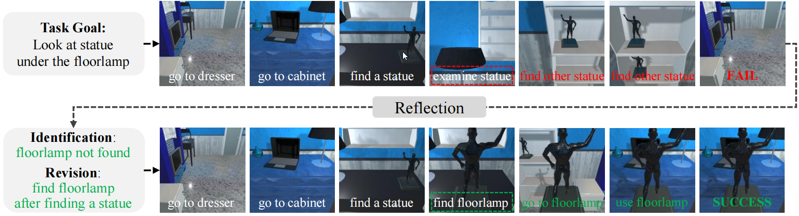
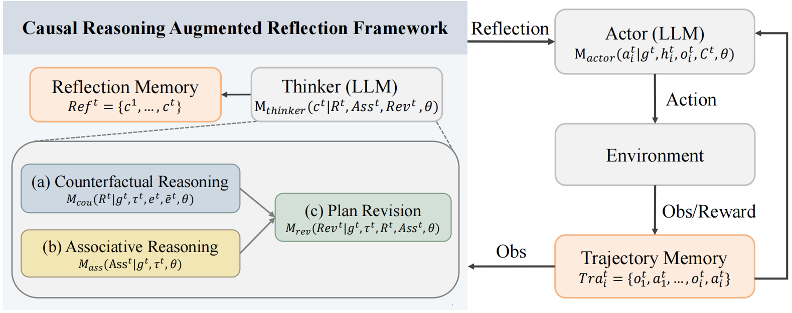
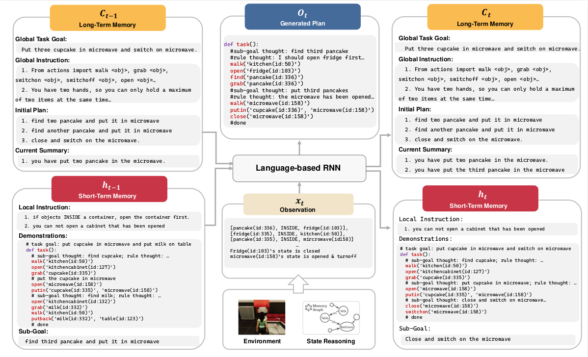

<!-- <h1 align="center"> Causal Inference Augmented Reflection for Long-Term Planning via LLMs </h1> -->

<!--

  ICRA 2025

-->

<!--
[author1](https://www.yuque.com/zhangjiatao-grdyv/rn49ht/lz080qshd6weqi0g)
-->

## Abstract
Recent developments suggest that Large Language Models (LLMs) can identify and correct errors in their generated responses using reflection mechanisms. However, when applied to long-term task planning, these methods reveal significant limitations. Reflection methods may neglect the causes of errors in earlier planning, producing results that contain inaccurate information, thereby leading to further mistakes in subsequent planning. This paper explores the reflection frameworks suitable for long-term task planning. Inspired by human causal cognitive processes, we introduce the Causal Reasoning Augmented Reflection Framework (CARF). CARF employs systematic causal reasoning to accurately identify the root causes of errors and to generate effective action plan revisions by integrating association information. We conducted experiments with household tasks in Alfworld, and the results show that our framework substantially increases the success rate in complex long-term tasks.

## Paper
<iframe  width="400" height="420" src="./Causal_Reasoning_Augmented_Reflection_for_Long-Term_Planning_via_LLMs.pdf"></iframe>

## Video
<iframe width="100%" height="420" src="https://www.youtube.com/embed/FSnNfoU0BK0?si=Tz1RhWBBs9c3JN3E" title="YouTube video player" frameborder="0" allow="accelerometer; autoplay; clipboard-write; encrypted-media; gyroscope; picture-in-picture; web-share" allowfullscreen></iframe>

## Results
Example of our frameworks for long-term task planning:

  

## Methodology
Our framework operates by taking historical task information and environmental feedback as input and producing reflection results as output. The framework comprises three stages: 
1. Counterfactual Reasoning is responsible for identifying and correcting critical erroneous steps and analyzing the RCE.
2. Associative Reasoning is tasked with inferring about the associations.
3. Plan Revision is charged with generating the action plan revisions for subsequent trials. Additionally, we have introduced a Memory Management module to manage the historical results generated.

  

 

  

## Experiment

    

          <video width="380" height="240" controls autoplay>
            <source src="./fail1.mp4"
                    type="video/mp4">
          </video>
    

    

          <video width="380" height="240" controls autoplay>
            <source src="./succ1.mp4"
                    type="video/mp4">
          </video>
    

  <pre style="text-align: center;  background-color: white; border: none;">             A.Initial Trial                                 B.Improved Trial </pre>

